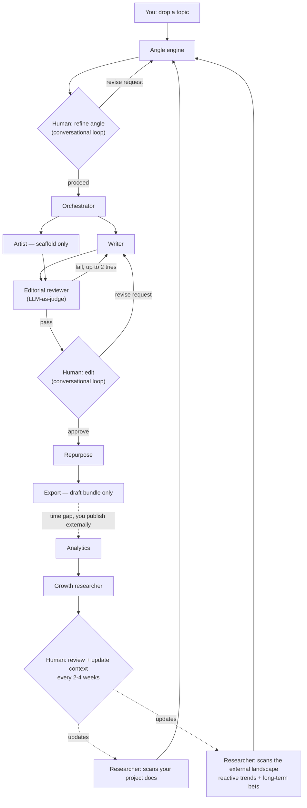

# sunny — AI content pipeline

Turns real build/work notes into publish-ready draft
bundles, with a human in the loop at every decision
point. Single-user, local-first, SQLite-backed. **It never publishes
anything, anywhere** — export always produces an unpublished draft bundle.

## The pipeline



## Quickstart

```bash
# One-time setup
cp config.example.json config.json   # then edit project_paths
python3 -m pipeline init             # creates data/pipeline.db

# Capture a topic from anywhere
python3 -m pipeline capture "shipped the reviewer loop today, judge caught my em dashes"

# Or drop lines into inbox.md and let the watcher pick them up
python3 -m pipeline watch-inbox

# Research: scan project docs + external landscape, write suggestions
python3 -m pipeline research

# Generate angles for a note, then refine conversationally
python3 -m pipeline angles <note_id>
python3 -m pipeline serve            # local page for refinement conversations

# Run a picked angle through writer -> reviewer -> edit -> repurpose -> export
python3 -m pipeline run <angle_id>

# Analytics (manual paste-in) + growth report
python3 -m pipeline analytics add <post_id> --platform substack --views 1200 --likes 40 --comments 6 --shares 3 --days 7
python3 -m pipeline growth-report

# Tests
python3 -m unittest discover -s tests -v
```

## Model configuration

The runtime LLM is set via the `PIPELINE_MODEL` env var and is deliberately
left unset — the choice of model is an open decision, made after real usage
data exists. With `PIPELINE_MODEL` unset (or `PIPELINE_MOCK=1`), the pipeline
runs in deterministic mock mode: every step executes end-to-end with canned,
schema-valid outputs, which is also how the test suite and golden fixtures run
without an API key.

Routing is by model-name prefix, so `PIPELINE_MODEL` also drives local and
Google models with no code change:

```bash
# Anthropic (cloud)
export ANTHROPIC_API_KEY=...
export PIPELINE_MODEL=<anthropic-model-id>

# Local via Ollama  (ollama serve running; model pulled)
export PIPELINE_MODEL=ollama/llama3.1:8b
export OLLAMA_HOST=http://localhost:11434     # optional, this is the default

# Google
export GEMINI_API_KEY=...
export PIPELINE_MODEL=gemini-2.0-flash
```

### Choosing a local model

The Substack essay is the hardest thing here: it must clear a 9-point voice
checklist (no em dashes, no signpost sentences, no banned lingo, length
bounds, gist line, and more) in at most two reviewer retries. Small models
(7-8B: `llama3.1:8b`, `mistral`) trip one rule per attempt and lean on the
escalation escape hatch, where you hand-fix the flagged line and export.
Mid-size instruct models (`mistral-nemo:12b`, `qwen2.5:14b`,
`llama3.1:70b` if you have the RAM) clear the bar unaided far more often.
Switching is one line: `export PIPELINE_MODEL=ollama/mistral-nemo:12b`,
then restart the server. `python3 -m pipeline doctor --judge` confirms the
model is reachable and the judge parses. Short formats (LinkedIn, social,
script) are well within reach of a 7-8B model regardless.

## Layout

| Path | What it is |
|---|---|
| `context/` | Brand voice, pillars, strategy, platform rules. The writer and reviewer read these. |
| `pipeline/` | The Python package: capture, researcher, angle engine, orchestrator, writer, reviewer, artist, repurpose, export, analytics, growth. |
| `web/` | Single-page local interface (no framework) for refinement conversations and researcher suggestions. |
| `fixtures/` | Golden note-to-post examples, re-run when voice/pillars/model change. |
| `tools/` | Pass-rate and golden-set scripts. |
| `data/` | SQLite db + generated files (gitignored). |
| `exports/` | Draft bundles (gitignored). |

## Hard constraints (enforced in code)

- **No auto-publish, ever.** There is no code path that calls a publish API.
  `ExportBundle.status` is hard-coded `"draft"` and validated.
- Reviewer failures loop back a **maximum of 2 times**, then escalate to Snow
  with the specific failure reason.
- Refinement conversations cap at **5 turns**, then force a decision prompt.
- Every inter-step handoff is a **validated schema** (`pipeline/schemas.py`).
- Landscape-scan claims **require a citable source** or they are rejected.
- Per-run **token ceiling** (`PIPELINE_MAX_TOKENS_PER_RUN`).
